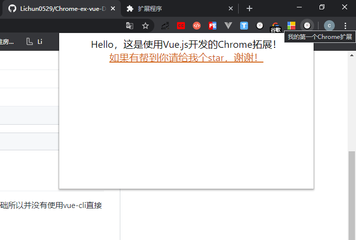

# Chrome-ex-vue-Demo
一个基于Vue.js的Chrome扩展开发模板，框架已搭好，直接编写功能即可。（由于在学习webpack基础所以并没有使用vue-cli直接生成）
### 演示

### 目录结构

```js
|-- Chrome-ex-vue-Demo //项目文件夹
    |-- .gitignore
    |-- App.vue 
    |-- LICENSE
    |-- package-lock.json
    |-- package.json
    |-- README.md
    |-- webpack.config.js
    |-- dist //打包后的项目,也是在chrome安装扩展时选择的目录
    |   |-- bundle.js //自动生成，webpack打包后的js
    |   |-- index.html //自动生成，webpack打包后的html
    |   |-- manifest.json //手动添加，chrome扩展配置文件
    |   |-- images//手动添加，扩展的图标文件
    |       |-- icon128.png
    |       |-- icon16.png
    |       |-- icon19.png
    |       |-- icon38.png
    |       |-- icon48.png
    |-- src //打包前的项目
        |-- index.html
        |-- main.js
        |-- components
        |-- css
        |-- js
        |-- static
```
### 如何使用扩展
1. 打开Chrome设置界面
2. 点击左侧下方扩展程序
3. 打开右上角“开发者模式”开关
4. 点击左上角“加载已解压的扩展程序”
5. 选择dist目录
6. 点击地址栏右侧新增的扩展（白色圆形时钟图标）

### 如何修改扩展
+ 编辑dist目录下的manifest.json文件

### 调试
1. 根目录下运行`npm install`
2. `npm run dev`
### 打包
+ 根目录下运行`npm run build`(新生成的文件会覆盖dist目录下已有的文件)
### 注意事项
+ manifest.json下的`"content_security_policy"`属性为必填项，否则会报错，[原因](https://www.cnblogs.com/smartXiang/p/6929617.html)。
+ 已添加的plugin和loader有
    + VueLoaderPlugin
    + HtmlWebpackPlugin
    + vue-loader
    + style-loader
    + css-loader
    + less-loader
### 踩坑记录
	- 1. vue runtime-only错误

	  vue.runtime.esm.js:620 [Vue warn]: You are using the runtime-only build of Vue where the template compiler is not available. Either pre-compile the templates into render functions, or use the compiler-included build.
	  
	  (found in <Root>)

		- 原因

			- 查找规则不同，网页中使用scrip标签导入的vue指向的是dist/vue.js，而使用import引入的vue指向的是dist/vue.runtime.common.js（严格版）

		- 解决方法

			- 方法一：不使用自动查找，直接指定路径：../node_modules/vue/dist/vue
			- 方法二：webpack配置文件中resolve节点下修改查找规则

		- 引申：import包查找规则（vue为例）

			- 1.查找根目录中有没有node_modules文件夹
			- 2.根据包名在node_modules中找到vue文件夹
			- 3.找到vue中packa.json文件
			- 4.在package.json中找到main节点对应的路径，路径指向的文件就是入口文件

	- 2. 无法引入.vue文件

		- 原因

			- webpack默认只能打包.js文件

		- 解决方法

			- 安装vue-loader和vue-template-compiler

		- 引申：loader调用过程

			- 1. 先拿到引入文件后缀名
			- 2. 在webpack.config.js中module节点下查找匹配规则，如果能找到则调用匹配规则进行处理，找不到则报错,多个loader时，由后向前调用
			- 3. 所有loader调用完毕将结果交给webpack打包合并，最终输出到出口js中

	- 3. 中无法引入.css文件

		- 原因

			- 同上

		- 解决方法

			- 安装css-loader和style-loader

	- 4. 打包完dist目录下index.html文件报错

	  Failed to load resource: net::ERR_FILE_NOT_FOUND

		- 原因

			- 未知

		- 解决方法

			- 删除webpack配置out节点下的publicPath

	- 5. 拓展添加到浏览器后报错 ：Uncaught EvalError

	  Uncaught EvalError: Refused to evaluate a string as JavaScript because 'unsafe-eval' is not an allowed source of script in the following Content Security Policy directive: "script-src 'self' blob: filesystem:".

		- 配置CSP

	- 6. 引入Bootstrap时Error: Can't resolve 'popper.js'

		- 手动安装popper.js

	- 7.  npm i bootstrap默认安装最新版bootstrap
### 参考资料
+ [webpack](https://www.webpackjs.com/)
+ [Chrome扩展及应用开发（首发版）](https://www.ituring.com.cn/book/1421)
+ [Chrome扩展非官方中文版文档](https://crxdoc-zh.appspot.com/extensions/getstarted)
+ [Chrome扩展官方文档](https://developer.chrome.com/extensions)
+ [Vue.js官方文档](https://cn.vuejs.org/index.html)
+ [使用Vue.js开发的扩展案例](https://github.com/lavyun/Easy-todo)